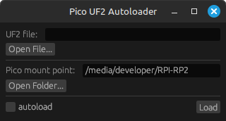

# Raspberry Pi Pico UF2 Autoloader

This is a simple tool to flash a UF2 file to a Raspberry Pi Pico.




## Usage

Click the "Open File..." button to select a UF2 file for flashing. Then, click the "Open Folder..." button to choose the Pico mount point where the UF2 file will be flashed.

By default, the tool will automatically load the UF2 file to the Pico board when it is connected in bootloader mode. If you prefer more control over the process, you can disable the Autoload feature by unchecking the "Autoload" checkbox. In this case, you will need to manually select the UF2 file and click the "Load" button to complete the flashing process.

## Build

### Linux
```shell
cargo run -r
```

### Windows
```shell
rustup target add x86_64-pc-windows-gnu
cargo build --target x86_64-pc-windows-gnu --release
```
